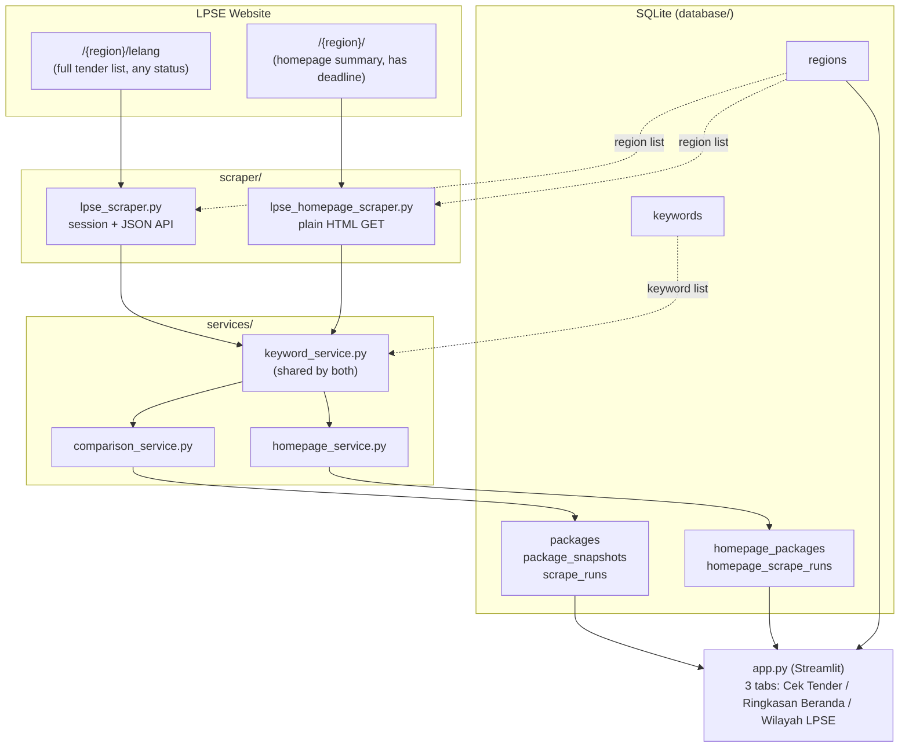

# Kalla Aspal — LPSE Monitor: Project Status

*Master status log. Read this before making changes — it's meant to answer
"what's done, what's not, and why" in one place for both Nikol and future
Claude sessions. Update it (append, don't overwrite) whenever something
changes — see "How to keep this file updated" at the bottom.*

Last updated: **13 September 2026**

---

## 1. What this project is

An offline-first Windows application that watches Indonesian government
procurement (LPSE/SPSE) sites for road-construction tenders and tells an
admin user, twice a day, whether anything new appeared. No cloud, no
login, no server — a local SQLite database and a Streamlit screen running
on one PC.

## 2. Architecture at a glance

Two independent data pipelines feed two independent parts of the database.
They are kept separate on purpose (see §5, decision `2026-09-13-b`) because
they come from different pages on the LPSE site and answer different
questions.

## 3. Status by phase

| Phase | What it covers | Status | Notes |
|---|---|---|---|
| 1 | Basic scraper, keyword filter, region input | ✅ Done | Real API reverse-engineered, not guessed |
| 2 | SQLite storage, new/existing/updated detection | ✅ Done | Full `package_snapshots` change history |
| 3 | Dashboard | 🟡 Partial | Metrics row exists in `app.py`; no separate page yet |
| 4 | Region management (add/edit/delete/activate) | ✅ Done | "Wilayah LPSE" tab; add+activate+delete built, no edit-in-place yet |
| — | Homepage summary scrape + Akhir Pendaftaran | ✅ Done | Added 2026-09-13, not in the original phase list — see §5 |
| 5 | Keyword management (add/edit/delete/enable) | ⬜ Not started | Table exists; UI doesn't |
| 6 | Excel integration | ⬜ Not started | |
| 7 | Scrape history / package detail / better errors | 🟡 Partial | `scrape_runs` + `homepage_scrape_runs` logged; no dedicated history page or package-detail page yet |

Legend: ✅ done · 🟡 partially done · ⬜ not started.

## 4. Known issues / not yet fixed

- HPS from the full-list (`/lelang`) API is abbreviated text ("15,9 M"),
  not an exact figure. The homepage scrape's HPS *is* exact — if exact HPS
  matters for a package, cross-check it there.
- **Pagu Anggaran is not available from either scraped page.** Would need
  a per-package detail-page request (not implemented).
- Ordering (earliest package first, latest last) is based on Package ID
  as a proxy for creation time, not a confirmed timestamp field — see §5,
  decision `2026-09-13-c`.
- No keyword management screen — edit `config/default_keywords.py` before
  first run, or the `keywords` table directly, until Phase 5 is built.
- No Excel export, no scheduling/notifications — later phases.
- The homepage scraper's assumption that a category's badge count always
  equals its row count (i.e. nothing is truncated) is only verified
  against categories with a handful of packages so far.
- Nothing in this project has been run/tested on the user's actual Windows
  machine yet by the assistant — only offline unit tests (28, all passing)
  run in the assistant's own sandbox, plus live investigation of the real
  site via a browser session. First real `streamlit run app.py` on
  Nikol's PC is still pending confirmation.

## 5. Changelog

Newest first. Each entry: what changed, why, and any decision worth
remembering.

### 2026-09-13 — Homepage scraper, region management, chronological ordering, this file

- **(a) Region Management ("Wilayah LPSE" tab) added.** Add/activate/
  deactivate/delete regions in the app itself; both check buttons now
  auto-load all active regions instead of requiring typed identifiers
  every time. Requested by Nikol so multiple regions can be monitored
  without re-typing.
- **(b) Decision: added a second, SEPARATE scraper for the region
  homepage** (`https://spse.inaproc.id/{region}/`), because it exposes a
  registration deadline ("Akhir Pendaftaran") that the full `/lelang` list
  doesn't have. Explicitly kept in its own module, own DB tables
  (`homepage_packages`, `homepage_scrape_runs`), own service
  (`homepage_service.py`), and own UI tab, per Nikol's request to keep the
  two datasets easy to tell apart rather than merging them. Investigated
  live via kalbarprov (a province-level LPSE) and confirmed via a
  cookie-free `fetch()` that no login/session is needed for this page —
  simpler than the full-list scraper.
- **(c) Decision: sort order changed to earliest-first, latest-last**,
  using Package ID (Kode Lelang) ascending as the ordering key. Neither
  scraped page exposes an explicit "uploaded at" timestamp; Package ID
  appears to increase monotonically with creation time in every sample
  checked, so it's used as the proxy. Applied to both `packages` and
  `homepage_packages` displayed tables. **This is an assumption, not a
  confirmed fact** — flag it if a future scrape shows IDs out of
  chronological order.
- **(d) This file (`PROJECT_STATUS.md`) created** as the single place to
  track phase status, decisions, and a dated history — requested by Nikol
  for continuity between sessions and for presenting project status
  cleanly.
- Added `push_to_github.bat` (double-click add+commit+push) after Nikol
  asked how to push more easily.
- 10 new tests added (homepage parsing, homepage service, region CRUD,
  ordering) — 28 total, all passing.

### 2026-09-13 — Phase 1 + 2 initial build

- Investigated `https://spse.inaproc.id/singkawangkota/lelang` live (via
  browser devtools network inspection, not guesswork) and found the real
  data source: `POST /{region}/dt/lelang?tahun={year}`, a DataTables JSON
  endpoint requiring a session cookie + a per-page-load CSRF-style token.
  Documented in full in `scraper/lpse_scraper.py`'s module docstring.
- Built: scraper, keyword filtering, SQLite schema (`regions`, `keywords`,
  `packages`, `package_snapshots`, `scrape_runs`), new/existing/updated
  comparison logic, and a minimal Streamlit screen.
- 18 offline unit tests written against real captured sample data.
- Git repo created and connected to GitHub
  (`https://github.com/NikiNici123/kalla-aspal`) — including
  troubleshooting `main` vs `master`, remote URL missing `https://`, and
  GitHub's dropped password-auth requiring a Personal Access Token.

## 6. Data model summary

| Table | Purpose |
|---|---|
| `regions` | LPSE regions being monitored (name, identifier, URL, active flag) |
| `keywords` | Road-related keyword list used to filter both datasets |
| `packages` | Latest known state of every `/lelang` package ever seen |
| `package_snapshots` | Change history for `packages` (status/HPS/value changes) |
| `scrape_runs` | Log of every full-list ("Cek Tender") run |
| `homepage_packages` | Latest known state of every homepage-summary package seen |
| `homepage_scrape_runs` | Log of every homepage-summary ("Cek Ringkasan Beranda") run |

## 7. Open decisions / suggested next steps

Not yet decided — Nikol's call:

1. **Keyword management UI** (Phase 5) — add/edit/delete/enable keywords
   from the app instead of editing a config file.
2. **Excel integration** (Phase 6) — the most-requested feature in the
   original spec; exports relevant packages into the reused
   `LPSE_Monitoring.xlsx` workbook with backups.
3. **Polish the Dashboard** (finish Phase 3) — a proper landing page
   instead of metrics embedded at the top of the first tab.
4. **Verify on Nikol's actual PC** — first real run of `streamlit run
   app.py`, first real double-click of `push_to_github.bat`, sanity-check
   against a region other than `singkawangkota`/`kalbarprov`.

## How to keep this file updated

Future sessions (Claude or otherwise): before changing anything, skim
§3 and §4 so you know what's already true. After making a change, add a
new dated entry at the TOP of §5 (don't delete old entries), and update
§3/§4 if the change affects phase status or known issues. Keep entries
short and factual — what changed, why, and any assumption worth flagging.
