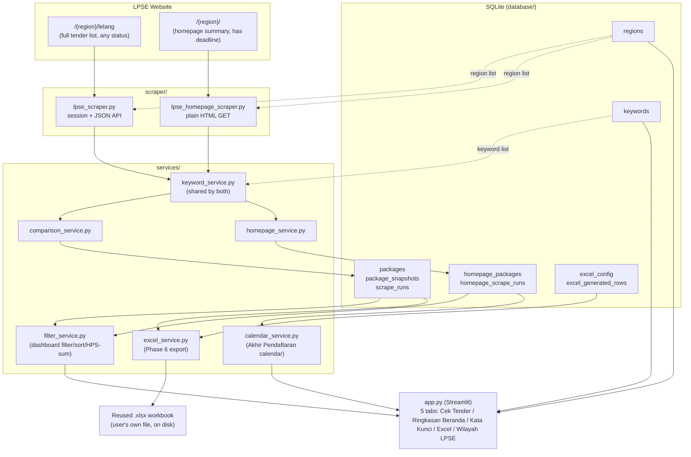

# Kalla Aspal — LPSE Monitor: Project Status

*Master status log. Read this before making changes — it's meant to answer
"what's done, what's not, and why" in one place for both Nikol and future
Claude sessions. Update it (append, don't overwrite) whenever something
changes — see "How to keep this file updated" at the bottom.*

Last updated: **13 September 2026 (late night — branding, Excel Tables, two-dataset export)**

---

## 1. What this project is

An offline-first Windows application that watches Indonesian government
procurement (LPSE/SPSE) sites for road-construction tenders and tells an
admin user, twice a day, whether anything new appeared. No cloud, no
login, no server — a local SQLite database and a Streamlit screen running
on one PC.

## 2. Architecture at a glance

Two independent data pipelines feed two independent parts of the database.
They are kept separate on purpose (see §5, decision `2026-09-13-b`) because
they come from different pages on the LPSE site and answer different
questions.

## 3. Status by phase

| Phase | What it covers | Status | Notes |
|---|---|---|---|
| 1 | Basic scraper, keyword filter, region input | ✅ Done | Real API reverse-engineered, not guessed |
| 2 | SQLite storage, new/existing/updated detection | ✅ Done | Full `package_snapshots` change history |
| 3 | Dashboard | 🟡 Partial | Metrics row + per-tab filter/sort/HPS-sum + deadline calendar done; no separate landing page yet |
| 4 | Region management (add/edit/delete/activate) | ✅ Done | "Wilayah LPSE" tab; add+activate+delete built, no edit-in-place yet |
| — | Homepage summary scrape + Akhir Pendaftaran | ✅ Done | Added 2026-09-13, not in the original phase list — see §5 |
| 5 | Keyword management (add/edit/delete/enable) | ✅ Done | "Kata Kunci" tab - add/rename/enable/disable/delete, all live |
| 6 | Excel integration | ✅ Done | "Excel" tab, one sub-tab per dataset - configurable file/sheet/cell/columns, replace vs append-new-only, auto-backup, row tracking, native Excel Table output, in-project file auto-discovery |
| 7 | Scrape history / package detail / better errors | 🟡 Partial | `scrape_runs` + `homepage_scrape_runs` logged; no dedicated history page or package-detail page yet |

Legend: ✅ done · 🟡 partially done · ⬜ not started.

## 4. Known issues / not yet fixed

- HPS from the full-list (`/lelang`) API is abbreviated text ("15,9 M"),
  not an exact figure. The homepage scrape's HPS *is* exact — if exact HPS
  matters for a package, cross-check it there.
- **Pagu Anggaran is not available from either scraped page.** Would need
  a per-package detail-page request (not implemented).
- Ordering (earliest package first, latest last) is based on Package ID
  as a proxy for creation time, not a confirmed timestamp field — see §5,
  decision `2026-09-13-c`.
- No scheduling/notifications yet — both check buttons are still run
  manually, twice a day, as planned for v1.
- The homepage scraper's assumption that a category's badge count always
  equals its row count (i.e. nothing is truncated) is only verified
  against categories with a handful of packages so far.
- Nothing in this project has been run/tested on the user's actual Windows
  machine yet by the assistant — only offline unit tests (50, all passing)
  run in the assistant's own sandbox, plus live investigation of the real
  site via a browser session. First real `streamlit run app.py` on
  Nikol's PC is still pending confirmation.
- **`LPSE_Monitor.exe` (via `build_exe.bat`) has NOT been built or tested.**
  The assistant has no Windows machine to run PyInstaller on, so
  `lpse_monitor.spec` follows the standard documented pattern for bundling
  a Streamlit app but is unverified. If building it errors, that's expected
  to be fixable, not a dead end — see the note inside `build_exe.bat`.
- The calendar in "Ringkasan Beranda" is a hand-built month grid (stdlib
  `calendar` module), not a third-party calendar widget — chosen so it
  could be unit tested offline. It supports hover (tooltip listing that
  day's packages) and click (shows full detail below the grid), per
  Nikol's request to avoid cluttering the view.
- Dashboard filter/sort controls recalculate the HPS total for exactly the
  rows currently displayed. Excel export is separate and always exports
  the FULL relevant-package list for whichever dataset you export,
  ignoring the dashboard tab's filters — exporting "only what I'm
  currently filtering to" isn't wired up yet (flagged in §7).
- **Excel Table support depends on the header row already having text in
  every exported column** (see §5 entry below) — if it's blank, the
  export still writes the data as plain values, it just skips turning it
  into a formatted Table for that run. Use "Buat File Baru" to get a
  correctly-headered file from scratch.
- The Kalla Aspal color theme (`ui/branding.py`, `.streamlit/config.toml`)
  has not been visually checked in a real browser by the assistant — no
  Streamlit runtime available in this sandbox (see below). CSS selectors
  target Streamlit's `data-testid` attributes, which are reasonably
  stable, but a future Streamlit version could rename them, in which case
  the affected styling would just silently stop applying (not crash).
- In-project Excel file auto-discovery only scans this project's own
  folder (not the whole computer) — by design, see services/excel_service.py.

## 5. Changelog

Newest first. Each entry: what changed, why, and any decision worth
remembering.

### 2026-09-13 (late night) — Branding, Excel Tables + two-dataset export, smaller calendar, cleanup

- **(a) Kalla Aspal branding.** New `ui/branding.py` + `.streamlit/config.toml`
  give the app a color system taken from the real KALLA ASPAL wordmark
  (gold `#F2A900`, green `#00693C`, charcoal `#33383D`) instead of
  Streamlit's generic defaults — a header banner echoing the wordmark,
  styled buttons/tabs/metrics/dividers, all traced back to a handful of
  named color tokens in one file so the "look" stays easy to adjust later.
  No logo image file is used (avoids losing track of an asset file) - the
  wordmark is recreated in styled text.
- **(b) Excel export now split into two, per-dataset panels.** The Excel
  tab has its own "Daftar Lengkap" and "Ringkasan Beranda" sub-tabs, each
  with independent file/sheet/cell/column/mode settings and its own
  export button — exporting one never touches the other's file or
  tracked rows. `excel_config` is now keyed by `dataset`
  (`'lelang'`/`'beranda'`) instead of a single row; **existing databases
  migrate automatically** on next start (`_migrate_excel_config_table` in
  `database.py`) — the old single config becomes the `'lelang'` config,
  `'beranda'` starts fresh. Column sets differ per dataset (Beranda adds
  Bagian/Kategori/Akhir Pendaftaran instead of Jenis Pengadaan/Status).
- **(c) Exports now write/update a native Excel Table**, not just plain
  cell values — banded rows + filter dropdowns are turned on
  automatically, so opening the workbook shows a ready-made table. Every
  export re-uses the SAME named table (`TabelDaftarLengkap` /
  `TabelRingkasanBeranda`) and just updates its range, instead of leaving
  a stale table behind or piling up duplicates as row counts change. Two
  safety checks, both tested: if the header row has a blank cell, or a
  DIFFERENT table already covers the same cells (e.g. Nikol made one by
  hand in Excel), table-ification is skipped for that export and the data
  is still written as plain values — never a corrupted/overlapping table.
  Toggle-able per dataset via a checkbox (on by default).
- **(d) In-project Excel file auto-discovery.** The Excel tab now scans
  the project folder itself (skipping `backups/`, `venv/`, `.git/`, Excel
  lock files) for `.xlsx` files and shows them as one-click buttons — so
  dropping a workbook straight into the project folder (as Nikol did)
  means picking it from a button instead of typing/pasting a path.
  Deliberately scoped to just this folder, not the whole computer.
- **(e) Bug fix: keyword rename no longer saves on every keystroke.** The
  "Kata Kunci" tab's inline rename box was wired directly to the keyword
  row, so Streamlit's rerun-on-every-interaction behavior meant it wrote
  to the database (and jumped the cursor) on each letter typed. Replaced
  with a small popover + form (explicit "Simpan" button) — found and
  fixed during this session's own code-cleanliness pass, before Nikol hit
  it, since it's not yet been exercised on the real app.
- **(f) Smaller calendar.** The Ringkasan Beranda calendar is now wrapped
  in a narrower centered column plus a scoped container
  (`ui.branding.CALENDAR_CONTAINER_KEY`) with smaller buttons/spacing, so
  it takes up noticeably less vertical space than before.
- **(g) Readability/performance pass on `app.py`.** Extracted the
  repeated "new/updated packages + region status" block into
  `render_result_banner()` and the whole Excel panel into
  `render_excel_export_panel(dataset, rows_getter)` used for both
  datasets, instead of duplicating that UI twice. Also fixed a latent bug
  found during this pass: the calendar's "selected date" lookup could
  reference an undefined `grouped` dict if the Beranda dataset was empty
  on a later run after previously having data (now always initialized).
  Performance-wise: kept changes to what could actually be verified
  offline (no live Streamlit to profile in this sandbox — see §4) —
  mainly the keystroke-write bugfix above and caching the (plain-string,
  safely cacheable) file-discovery scan; did NOT add broad SQLite query
  caching, since that risks showing stale data after a scrape without a
  live app to verify cache invalidation against.
- 9 new/updated Excel tests (two-dataset export, Excel Table
  create/update/skip-on-blank-header/respect-user's-own-table, file
  discovery) — 56 total, all passing.
- `requirements.txt`: bumped `streamlit` floor to `>=1.37` (needs
  `st.container(key=...)`, used to scope the calendar's CSS).

### 2026-09-13 (night) — Fixed run_app.bat not installing new dependencies

- **Bug found by Nikol on first real run:** `ModuleNotFoundError: No
  module named 'openpyxl'` when launching via `run_app.bat`. Cause:
  `run_app.bat` only ran `pip install -r requirements.txt` the very first
  time it created the `venv` folder - since Nikol's `venv` already existed
  from the original Phase 1+2 setup (before `openpyxl` was added to
  `requirements.txt` for the Excel feature), it was never installed.
- **Fix:** `run_app.bat` now always runs `pip install --quiet -r
  requirements.txt` on every launch, not just on first setup. `pip` skips
  anything already installed at the right version, so this stays fast on
  normal runs and automatically picks up any future new dependency.
- **This is the first confirmed real-machine bug** — everything before
  this had only been verified via offline tests or a browser session, per
  §4. Good sign that the rest of the app got this far without erroring.

### 2026-09-13 (evening) — Dashboard filters, deadline calendar, Kata Kunci tab, Excel export, packaging scripts

- **(a) Dashboard polish (partial Phase 3):** both "Cek Tender" and
  "Ringkasan Beranda" tabs now have Wilayah/Status/Kategori filters and a
  sort dropdown (earliest/latest, name A-Z/Z-A, HPS high/low), plus a
  "Jumlah Paket" and "Total HPS" metric that recalculates from whatever is
  currently filtered — e.g. filtering Status to "Masa Sanggah" shows the
  HPS sum for just those packages, per Nikol's request. Logic lives in
  `services/filter_service.py` (framework-independent, unit tested).
- **(b) Built-in Akhir Pendaftaran calendar** added to "Ringkasan Beranda".
  A month grid (stdlib `calendar`, not a third-party widget — see §4)
  marks each day with a deadline; hovering a marked day shows a tooltip
  listing that day's packages, clicking it shows full detail below the
  grid without permanently cluttering the tab. Logic in
  `services/calendar_service.py`.
- **(c) Keyword management ("Kata Kunci" tab) — Phase 5 complete.**
  Add/rename/enable-disable/delete keywords directly in the app; no more
  editing `config/default_keywords.py` or the SQLite table by hand.
  DB functions: `add_keyword`, `update_keyword_text`, `set_keyword_enabled`,
  `delete_keyword` in `database/database.py`.
- **(d) Excel export ("Excel" tab) — Phase 6 complete.** New
  `services/excel_service.py` + `excel_config`/`excel_generated_rows`
  tables. Configurable file path / sheet name / start cell / which columns
  to export; two modes ("Ganti Semua" = replace, "Tambah Baru Saja" =
  append-new-only); ALWAYS backs up the target file first
  (`backups/<name>_<timestamp>.xlsx`), never touches any row/cell the app
  didn't itself write (tracked via `excel_generated_rows`), and gives a
  friendly Indonesian message (not a raw traceback) if the file is open in
  Excel and locked. "Pagu Anggaran" is still not an available column — see
  known issue in §4, unchanged from before.
- **(e) Packaging/distribution scripts added, honestly flagged as
  unverified:** `run_app.bat` (double-click launcher — sets up the venv on
  first run, then just runs `streamlit run app.py`, no typing needed) and
  `build_exe.bat` + `lpse_monitor.spec` + `launcher.py` (builds a standalone
  `LPSE_Monitor.exe` via PyInstaller). The assistant could not build or
  test the `.exe` itself (no Windows machine available to it) — see the
  known issue in §4 for what to do if it errors on first build.
- **(f) "Access on another device" clarified (see §7):** no new code was
  needed for this — cloning/pulling the GitHub repo with **GitHub Desktop**
  (no CMD typing) onto the other PC, then double-clicking `run_app.bat`
  there, is the recommended no-CMD path. A true "already-built .exe on a
  USB stick" workflow depends on (e) actually building successfully first.
- 22 new tests added (Excel export round-trips incl. backup/replace/
  append-new/untouched-cells/locked-file, keyword CRUD, filter/sort/HPS-sum,
  calendar grouping/grid/month-navigation) — 50 total, all passing.
- `requirements.txt`: added `openpyxl` (was missing despite being used by
  the Excel feature).

### 2026-09-13 — Homepage scraper, region management, chronological ordering, this file

- **(a) Region Management ("Wilayah LPSE" tab) added.** Add/activate/
  deactivate/delete regions in the app itself; both check buttons now
  auto-load all active regions instead of requiring typed identifiers
  every time. Requested by Nikol so multiple regions can be monitored
  without re-typing.
- **(b) Decision: added a second, SEPARATE scraper for the region
  homepage** (`https://spse.inaproc.id/{region}/`), because it exposes a
  registration deadline ("Akhir Pendaftaran") that the full `/lelang` list
  doesn't have. Explicitly kept in its own module, own DB tables
  (`homepage_packages`, `homepage_scrape_runs`), own service
  (`homepage_service.py`), and own UI tab, per Nikol's request to keep the
  two datasets easy to tell apart rather than merging them. Investigated
  live via kalbarprov (a province-level LPSE) and confirmed via a
  cookie-free `fetch()` that no login/session is needed for this page —
  simpler than the full-list scraper.
- **(c) Decision: sort order changed to earliest-first, latest-last**,
  using Package ID (Kode Lelang) ascending as the ordering key. Neither
  scraped page exposes an explicit "uploaded at" timestamp; Package ID
  appears to increase monotonically with creation time in every sample
  checked, so it's used as the proxy. Applied to both `packages` and
  `homepage_packages` displayed tables. **This is an assumption, not a
  confirmed fact** — flag it if a future scrape shows IDs out of
  chronological order.
- **(d) This file (`PROJECT_STATUS.md`) created** as the single place to
  track phase status, decisions, and a dated history — requested by Nikol
  for continuity between sessions and for presenting project status
  cleanly.
- Added `push_to_github.bat` (double-click add+commit+push) after Nikol
  asked how to push more easily.
- 10 new tests added (homepage parsing, homepage service, region CRUD,
  ordering) — 28 total, all passing.

### 2026-09-13 — Phase 1 + 2 initial build

- Investigated `https://spse.inaproc.id/singkawangkota/lelang` live (via
  browser devtools network inspection, not guesswork) and found the real
  data source: `POST /{region}/dt/lelang?tahun={year}`, a DataTables JSON
  endpoint requiring a session cookie + a per-page-load CSRF-style token.
  Documented in full in `scraper/lpse_scraper.py`'s module docstring.
- Built: scraper, keyword filtering, SQLite schema (`regions`, `keywords`,
  `packages`, `package_snapshots`, `scrape_runs`), new/existing/updated
  comparison logic, and a minimal Streamlit screen.
- 18 offline unit tests written against real captured sample data.
- Git repo created and connected to GitHub
  (`https://github.com/NikiNici123/kalla-aspal`) — including
  troubleshooting `main` vs `master`, remote URL missing `https://`, and
  GitHub's dropped password-auth requiring a Personal Access Token.

## 6. Data model summary

| Table | Purpose |
|---|---|
| `regions` | LPSE regions being monitored (name, identifier, URL, active flag) |
| `keywords` | Road-related keyword list used to filter both datasets |
| `packages` | Latest known state of every `/lelang` package ever seen |
| `package_snapshots` | Change history for `packages` (status/HPS/value changes) |
| `scrape_runs` | Log of every full-list ("Cek Tender") run |
| `homepage_packages` | Latest known state of every homepage-summary package seen |
| `homepage_scrape_runs` | Log of every homepage-summary ("Cek Ringkasan Beranda") run |
| `excel_config` | Current Excel export settings, one row per dataset (`lelang`/`beranda`) - file path, sheet, start cell, columns, mode, Excel-Table toggle |
| `excel_generated_rows` | Which (file, sheet, row) triples this app wrote - so exports never touch rows a person entered by hand |

## 7. Open decisions / suggested next steps

Not yet decided — Nikol's call:

1. **Verify the app visually on Nikol's actual PC.** `run_app.bat` has
   been confirmed to at least launch (it surfaced the missing-`openpyxl`
   bug, now fixed — see §5), but the assistant has never seen the app
   render in a real browser: the Kalla Aspal branding/colors, the smaller
   calendar, the two Excel sub-tabs, and `build_exe.bat` are all still
   unverified beyond offline logic tests. Worth a quick look-over.
2. **Excel export scope** — right now it always exports the FULL relevant
   list for a dataset, ignoring the dashboard's active filter. Worth
   revisiting once Nikol has used the filter/Excel tab a bit and knows
   whether "export only what I'm currently filtering to" is actually wanted.
3. **Finish Phase 3** — a proper dashboard/landing page, rather than
   metrics + filters embedded inside each tab.
4. **Finish Phase 7** — a dedicated scrape-history view and a per-package
   detail/change-history page (the data already exists in
   `package_snapshots` / `scrape_runs` / `homepage_scrape_runs`, just no
   UI yet).
5. **Scheduling/notifications** — still fully manual (open the app,
   click the check buttons); not started.

## How to keep this file updated

Future sessions (Claude or otherwise): before changing anything, skim
§3 and §4 so you know what's already true. After making a change, add a
new dated entry at the TOP of §5 (don't delete old entries), and update
§3/§4 if the change affects phase status or known issues. Keep entries
short and factual — what changed, why, and any assumption worth flagging.
